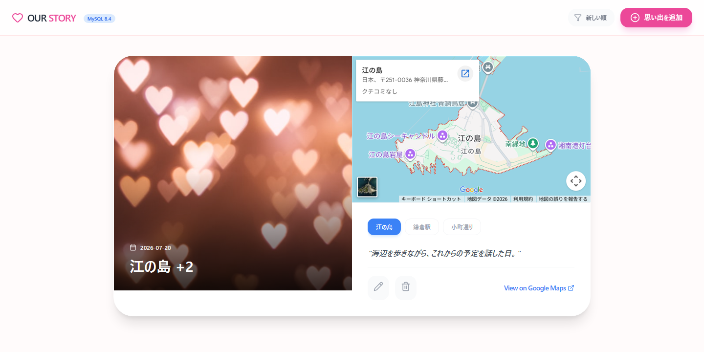
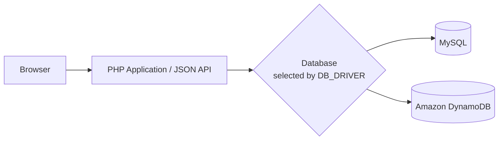

# our-story

写真と思い出を、日付・説明・場所と一緒に残せるWebアプリケーションです。
編集者向け画面と閲覧専用画面を備え、MySQLまたはDynamoDBを保存先として利用できます。

<p align="center">
	
</p>

## Features

- 思い出の登録・編集・削除
- 写真URL・アルバムURL・場所情報の管理
- 日付順の一覧表示
- 編集者と閲覧者の権限分離
- セッションベースのログイン認証
- MySQL / DynamoDBの切り替え
- JSON APIによるデータ操作

## Tech Stack

- **Frontend:** JavaScript, React, Tailwind CSS, Babel
- **Backend:** PHP
- **Database:** MySQL, Amazon DynamoDB
- **Infrastructure:** Apache HTTP Server, Docker, Docker Compose, Amazon EC2

## Architecture



`.env`の設定項目`DB_DRIVER`で、保存先をMySQLまたはAmazon DynamoDBから選択できます。
`DB_DRIVER`は接続先だけを切り替えるため、既存データの移行には`scripts/`の移行スクリプトを使用します。

## Project Structure

```text
our-story/
├── index.php / index2.php       # 編集者画面 / 閲覧専用画面
├── login.php                    # ログイン認証
├── api.php                      # 思い出データのJSON API
├── config.php / dynamo.php      # 設定・ストレージ層
├── assets/                      # フロントエンド資材
├── db/                          # MySQLスキーマ・ローカル用シード
├── docs/                        # デプロイ・運用ドキュメント
├── scripts/                     # MySQL ↔ DynamoDB移行
├── Dockerfile
└── docker-compose.yml
```

## 前提条件

- Git
- Docker Desktop

## Quick Start

Quick Startでは、`local`プロファイルを使用してWebアプリケーションとMySQLをPC上に起動し、動作確認用アカウントを自動登録します。

Docker Desktopを起動し、PowerShell（Windows）またはターミナル（macOS）で次を実行します。

```shell
git clone https://github.com/shota-akita/our-story.git
cd our-story
cp .env.example .env
docker compose --profile local up -d --build
```

起動後、`http://localhost:8080` を開き、次のローカル専用アカウントでログインします。

| Role | Username | Password |
|---|---|---|
| 編集者 | `demo-editor` | `password` |
| 閲覧専用 | `demo-viewer` | `password` |

この2アカウントはローカル検証専用です。公開環境や本番環境では使用しないでください。任意のユーザー名とパスワードを設定する方法は、[デプロイガイドの「ログインユーザー管理」](docs/deployment.md#create-a-login-user)を参照してください。

停止方法やデータの扱いについては、[デプロイガイドの「停止」](docs/deployment.md#stop)を参照してください。

## Documentation

- [デプロイガイド](docs/deployment.md) - デプロイ、更新、停止、ログインユーザー管理、データベース移行
